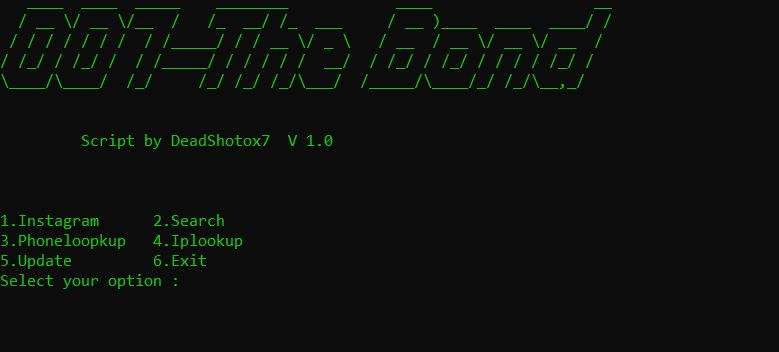

# Inofrmation about the Script 

OSNIT Script , which let help you to find the information of your Friend , Family , the crush that dosen't talk to you and your enemies 😎

# Screenshot of the Script


# Features 
1. Instagram osnit 
2. Phonenumber osnit
3. Search Username Across the Social Media 
4. Search the web 
5. IplookUp


# Disclaimer
Disclaimer : - DeadShot0x7 will not responsible if you misuse the script , by using  the script you're that you will be responsible for the loss you have made 
# Version 
 Version of 007-TheBond is 2.0 , this is official Release of the Project 

# Usage

1. Clone the repository by using `git clone`
2. Go to the **cloned** directory 
`cd 007-TheBond`
3. Create a virutal environment and activate the environment
```
python -m venv venv
source venv/bin/activate
```
3. Install the required packages or run `setup.sh` 
```
pip install -r requirements.txt
```
OR
```
./setup.sh
```
4. Run the Script 
```
python 007-TheBond.py
```

# Testing
This script is tested  on these operating system 

1. Kali Linux
2. Parrot Linux
3. Termux (find Instagram user is not working currently)
4. Garuda Linux 

# Like and Fork
Leave a like to the Repository and feel free to fork the project  🙂

# Pull Request 
Add your Ideas to the project, feel free to pull request the project 

# Discord Server 
Join the The Discord Community  to know the Updation and Accounment of the tools 😊
(https://discord.gg/WAhQ8EcV4C) 

# Disscussion 
if you have any idea or Sugesstion for the tool do let's us know in the Discussion and your view will be Appreciated 🙌 ,  Want to discuss,  message me in the  Dicussion section 🧐

# Sponor  And Donation's
this Tool is made and Mainted by the One Developer , Kindly show your support by Sponoring the poject  . Sponoring the Project will help the Developer to Bring Amazing Features
link to sponsor : 
https://www.buymeacoffee.com/Deadshot0x7
http://www.ko-fi.com/deadshot0x7
https://paypal.me/Deadshot0x7?locale.x=en_GB

google Upi : -  

sviquarahmed@okaxis
# Website 
[](https://app.netlify.com/sites/007-thebond/deploys)
# Producthunt
<a href="https://www.producthunt.com/posts/007-thebond?utm_source=badge-review&utm_medium=badge&utm_souce=badge-007-thebond#discussion-body" target="_blank"></a>
