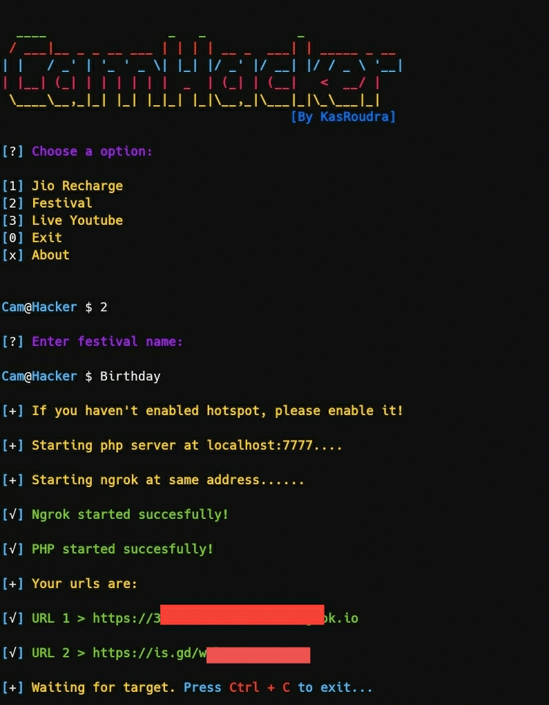

<h2 align="center"><u>CamHacker</u></h2>


<h4 align="center"> Hack anyone's camera and get images!</h4>

<p align="center">
    
     
  
  
    
<br>
    
    
    
    
</p>

### [+] Description
CamHacker is a phishing tool. It will generate a link. If anyone opens the link and permits camera access, his/her photo will be captured and sent to you!

### [+] Installation

 - `git clone https://github.com/KasRoudra/CamHacker`
 - `cd CamHacker`

For termux, use additional command `termux-setup-storage`
 - `bash ch.sh`

##### Or Run Directly
```
wget https://raw.githubusercontent.com/KasRoudra/CamHacker/main/ch.sh && bash ch.sh
```

### [+] Features
 - Three Templates
 - Get IP, Location, Device type and Browser
 - Dual Tunneling (Ngrok and Cloudflare)
 - Choose where to save images(custom directory) 
 - Error Diagnoser
 
### [+] Preview 


### [+] Depenencies
 - `php`
 - `curl`
 - `wget`
 - `unzip`

All of the necessary depenencies will be installed automatically in first run!

### [+] Note
You need to use good (not mini version like opera mini) browsers as chrome/brave/mozila to get image captured. Although some browsers can block this CamHacker, however it works in most devices.

### [+] Credits 
Thanks to <a href="https://github.com/noob-hackers/grabcam">Noob-Hackers</a>, <a href="https://github.com/Techchipnet/camphish">Technochip</a> and <a href="https://github.com/TheLinuxChoice">Linux Choice</a> for their open source codes!

### [+] Disclaimer 
***This tool is developed for educational purposes. Here it demonstrates how camera phishing works. If anybody wants to gain unauthorized access to someones camera, he/she may try out this at his/her own risk. You have your own responsibilities and you are liable to any damage or violation of laws by this tool. The author is not responsible for any misuse of CamHacker!***

### [+] Find me on 
<a href="mailto:kasroudrakrd@gmail.com" target="_blank"></a>

<a href="https://m.me/KasRoudra" target="_blank"></a>

