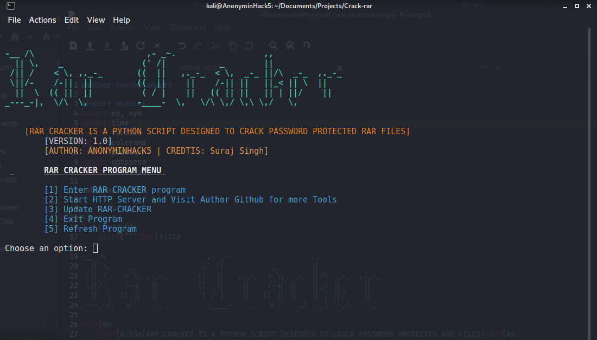

# Crack-rar
Crack-rar is a python3 script which is created for bruteforcing or cracking of rar password protected files in your termina with a top speed engine and cracking of password protected zip files

<p align="center">Crack-rar is seen to crack RAR password protected files and zip files much easier and also reads the rar if it is bad</p>
<br>




<br>

# Authors

```
AnonyminHack5 and Credits to Suraj Singh
```

# Tested On
Crack-rar has been tested on the following systems and certain that they work;

[✔] Termux

[✔] Parrot OS

[✔] Windows

[✔] lubuntu

[✔] Ubuntu

[✔] Slax Linux

[✔] Kali Linux

# Prequistics or Requirements to run this tool

[✔] A linux environment

[✔] Python3

[✔] Figlet

[✔] lolcat

[✔] rarfile


# Wanna encourage us? 

<br>
To be able to encourage AnonyminHack5 and support this project, kindly donate via paypal through <a href="https://paypal.me/kwasconcept" target="_blank">here</a>

# Features of Crack-rar
#### [+] Cracks Offline!!
#### [+] Cracks Fast!! [Depends on Wordlist and Number of cores]
#### [+] Cross-platform Supported
#### [+] Supports only RAR files
#### [+] Works with/without root!!

# Options
```
 --version             show program's version number and exit                                                        
  -h, --help            show this help message and exit                                                               
  -f FILENAME, --file=FILENAME                                                                                        
                        Please Specify Path of Rar File to crack                                                      
  -d DICTIONERY, --dict=DICTIONERY                                                                                    
                        Please Specify Path of Dictionary or wordlist                                                 
  -o OUTPUT, --output=OUTPUT                                                                                          
                        Please Specify Path for Extracting the rar program                                            
  -r RESULT, --result=RESULT                                                                                          
                        Please Specify Path if You Want to Save Result                                                
  -c CRUNCH, --crunch=CRUNCH                                                                                          
                        For Using Passwords Directly from crunch use this
                        arguments: -c True or --crunch True
```

# Usage
<code> python3 crack-rar.py -h </code> <b>MENU AND STARTUP PROGRAM </b>

# Installation of Crack-rar
Use the below commands to install Crack-rar into your terminal

First Clone my repo
```
git clone https://github.com/TermuxHackz/Crack-rar
```
Then GO into Crack-rar directory
```
cd Crack-rar
```
Grant permissions to all files in it
```
chmod 777 *
```
Install nodejs and npm into terminal
For Termux: <code>pkg install nodejs npm</code>
For Linux: <code>sudo apt install nodejs npm</code>

Install requirements
```
pip install -r req.txt
```

Install lolcat
```
pip install lolcat
```

Start the Crack-rar program
```
python3 crack-rar.py -h
```

# Bugs and Feedbacks
If you use this script and notice bugs in it kindly report those bugs to me <a href="mailto:AnonyminHack5@protonmail.com" target="_blank">here</a> and i will do my best to respond and fix those bugs. If you also have improvements you would like me to add to the script. Kindly Email to me your suggestion as i wil try to include your suggestions to the script. Thank you all.


# Language

#### [+] Python3
#### [+] Nodejs
#### [+] HTML


I hope you all like this script

Kindly Star/Fork repo and continue to support me.

DO NOT COPY AND MODIFY THIS SCRIPT <b>LEECHERS BEWARE</b>

# Contact me
  #### > [+] Facebook: <a href="https://facebook.com/AnonyminHack5" target="_blank">AnonyminHack5</a>
  #### > [+] Whatsapp: <a href="https://wa.me/+2349033677589?text=Hi+AnonyminHack5+my+name+is+ ">AnonyminHack5</a>
  #### > [+] Twitter: <a href="https://twitter.com/AnonyminHack5" target="_blank">AnonyminHack5</a>
  #### > [+] Website: <a href="https://termuxhackz.github.io" target="_blank">TermuxHackz Society</a>
  #### > [+] Telegram Bot: <a href="https://t.me/Termux1_bot" target="_blank">Termux Bot</a>
  #### > [+] Telegram Channel: <a href="https://t.me/termuxhackz1" target="_blank">TermuxHackz Society Channel</a>
  #### > [+] VMware Workstation pro for free: <a href="http://vmwaredownload.6te.net" target="_blank">Download VMware WorkStation Pro for free</a>
  
  


