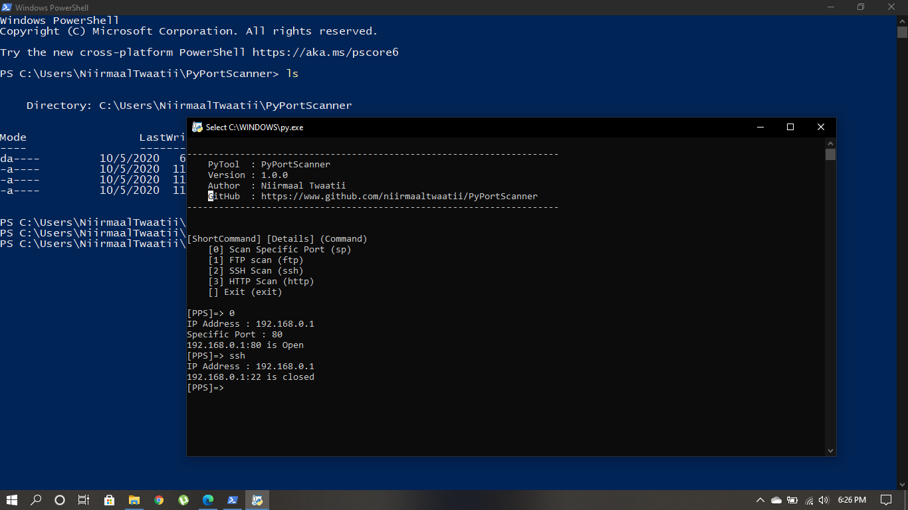

# PyPortScanner
Basic Port Scanner with Python Socket

## Installtion & SetUp
Install Git & Python3 for Your OS
```
git clone https://github.com/niirmaaltwaatii/PyPortScanner
cd PyPortScanner
python pps.py
```
### Screenshot

