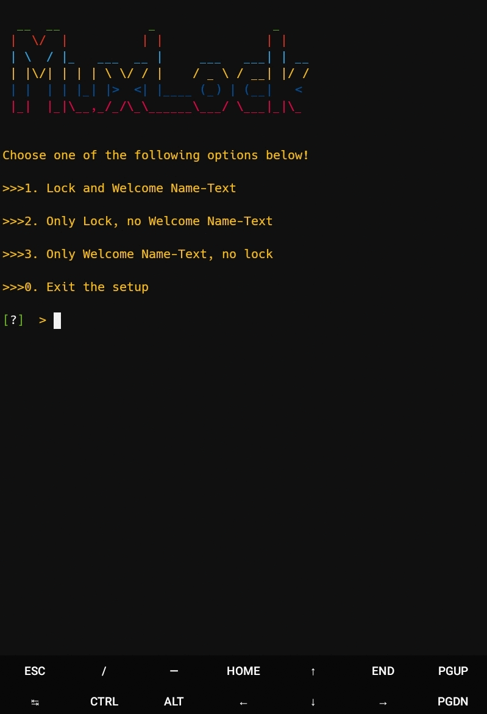

# MuxLock

### [+] Created By <a href="https://github.com/KasRoudra">KasRoudra</a>

### [+] Disclaimer :
***MuxLock is a tool to lock your termux. If you follow every instructions carefully, you can enjoy this tool. But if you do something beyond instruction, I will not be responsible for it!***

### [+] Installation

```apt install git python -y```

```git clone https://github.com/KasRoudra/muxlock```

```cd muxlock```

```python setup.py```

### Or, Use Single Command
```
apt install python git -y && git clone https://github.com/KasRoudra/muxlock && cd muxlock && python setup.py
```

### Example



## If you forget password, Enter "forgotten" in both input!

#### [+] Enter "removelock" command to remove lock

## [+] Find Me on :
<ul>
<li><a href="https://facebook.com/KasRoudra"></a></li>
<li><a href="https://m.me/KasRoudra"></a></li>
<li><a href="mailto:kasroudrard@gmail.com"></a></li>
</ul>
