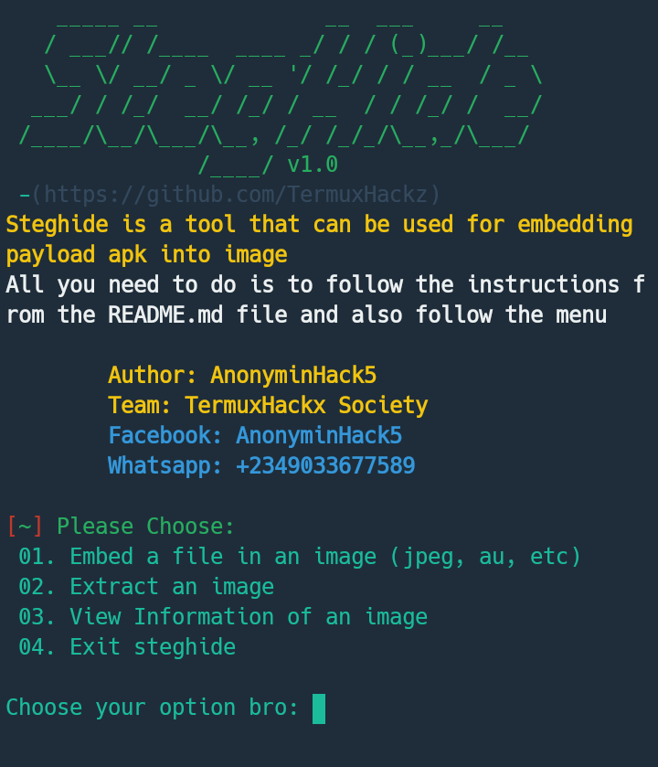

# steghide
Steghide is a steganography program that is able to hide data in various kinds of image- and audio-files. The color- respectivly sample-frequencies are not changed thus making the embedding resistant against first-order statistical tests.
<h4>How to use steghide</h4>

To use steghide,  you need to install the steghide package into your terminal first, now i will give you steps needed to use steghide

 
 
# Screenshot 

# Tested on
####[1] Termux!! 
 

<h2 style="color: blue;">Steps involved in using steghide</h2>

I would be Giving you guys the steps involved in running steghide, kindly follow these steps before you run the installation commands, dont be too forward!!!!! 

 
<li>Step1: Install the installation Commands first. (This is easy,  i wont elaborate on it) </li>
<li>Step2: Type <code>termux-setup-storage</code> in your termux terminal. </li>
<li>Step3: Get the apk you want to embed, then open your file manager (on ur phone), then cut/copy/move the apk into your "DCIM" folder or "downloads" folder 📁 in your file manager. </li> 
<li>Step4: Look for an image you want to embed the apk into, then open your file manager and move/cut/copy the image into where you moved/cut/copied the apk eg if you moved the apk into your dcim folder,  then also move the inage into your dcim folder, and vice versa. </li>
<li>Step5: Remember the folder you stored both the apk and the image</li>
<li>Step6: Open your termux</li>
<li>Step7: Type <code>cd storage</code></li>
<li>Step8: Next Step is for you to go to the directory where kept both the apk and the image, eg if the apk and the image in your dcim folder, type <code>cd dcim</code> and if its in your download folder, type <code>cd downloads </code> </li>
<li>Step9: Make sure the apk and image you selected has a short name, if it doesn't, rename it</li>
<li>Step10: Type <code>cp nameofapk -r /$HOME/steghide</code> after that, lets copy the image to steghide folder by typing <code>cp nameofimage -r /$HOME/steghide</code> </li>
<li>Step11: Replace <b>nameofapk<b> with the actual name of the apk, and if the apk has two words in it like maybe fb lite.apk,  instead, type <code>cp 'fb lite.apk' -r /$HOME/steghide </code>, same thing goes for the image, but if the apk/the image doesnt have two words in it,  dont add the ''</li>
<li>Step12: Replace <b>nameofimage</b> witg the actual name of the image and also with the extension, either png, jpeg, etc. Example, if the image is named Screenshot-222222.png. You would need to type <code>cp Screenshot-22222.png -r /$HOME/steghide</code>, and if the image has two words named <b>image 1.jpg</b>, you would need to type <code>cp 'image 1.jpg' -r /$HOME/steghide</code></li>
<li>Step13: Now go to steghide directory by typing <code>cd steghide</code> , Then run the <code>bash install.sh</code> and lastly type <code>bash steghide.sh</code></li>
 
 

We are almost done with all the steps alright, i want you to get it right, as i have explained them in the most simplest form as possible

 
<li>Step14: In the menu of the script, you would see "Embed a file in an image (jpeg, au, etc) " type the number it falls under which is 01 or 1</li>
<li>Step15: It would ask you to Enter an image or file path:, now type in the name of the image you copied into the tool's directory eg If the image was named *image.PNG*,  type <code>image.PNG</code> </li>
<li>Step16: It would ask you to Enter file you want to embed:, now type in the name of the apk you  copied into the tools directory eg if the apk was named *whatsapp.apk*, type <code>whatsapp.apk</code> </li>
<li>Step17: Next it would ask you to Enter Passkey:, now type in any number or character, by remember it and we're done!! </li>
 
 
<h3>Author</h3>
<b>AnonyminHack5</b>

<h3>Language</h3>
* Shell script

# Installation Commands 

> git clone https://github.com/TermuxHackz/steghide

> cd steghide 

> bash install.sh

> bash steghide.sh

There you go all done!! 

Follow/Contact me on these platforms!! : 
<a href="https://facebook.com/AnonyminHack5" target="_blank" alt="AnonyminHack5">Facebook</a> 
<a href="https://t.me/AnonyminHack5" target="_blank" alt="My Telegram">Telegram</a> 
<a href="https://wa.me/+234903367758" target="_blank">Whatsapp</a> 

Get to know more about hacking, spamming, and so much more 
Start my bot and also join my channel

<a href="https://t.me/Termux1_bot" target="_blank">Message my telegram bot</a>
<a href="https://t.me/termuxhackz1" target="_blank">Join my telegram channel</a>

 
# Star/Fork this repo and follow me on github <a href="https://github.com/TermuxHackz">here</a>

