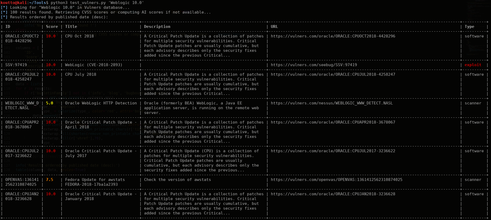

===============
Vulners-lookup
===============

**Small script to perform vulnerabilities/exploits lookup on Vulners Database (https://vulners.com/)**.

Vulners aggregates lots of various sources (including exploit-db, 0day.today, Nessus db, OpenVAS db...), 
see https://vulners.com/stats for a complete list.

This script is using Vulners Python API available at https://github.com/vulnersCom/api

Thanks to Vulners team for providing this great service !

============
Installation
============

Install Python3 dependencies:

.. code-block:: console

	sudo pip3 install -r requirements.txt

=====
Usage
=====

**Search for vulnerabilities & exploit (global search requiring API key):**

.. code-block:: console

	python3 vulners-lookup.py all --apikey <your-API-key> 'product name/version to search'

**Search for software version via API used by Nmap Vulners NSE script & Burp add-on:**

.. code-block:: console

	python3 vulners-lookup.py software --name <Product-Name> --version <Version-Number>

=======
Example
=======

