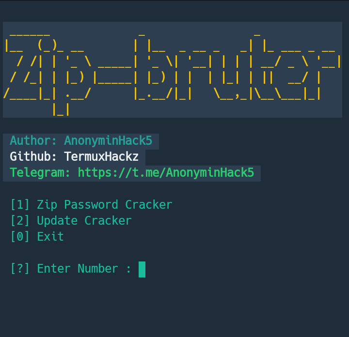
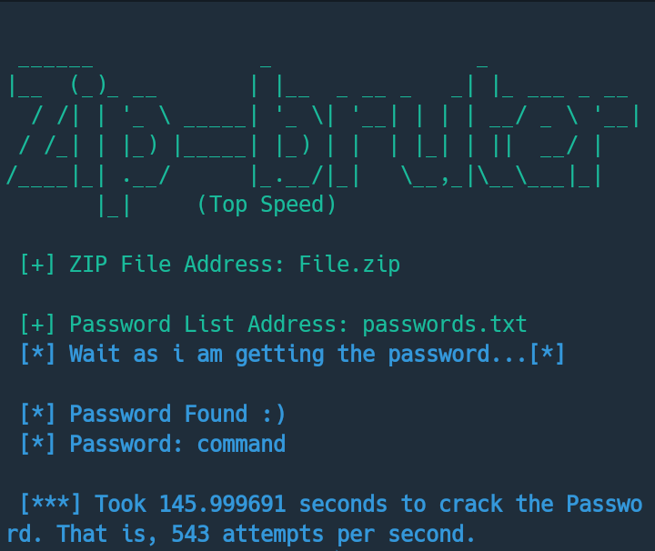

# zip-brute
## Zip File Password Cracking with Using Password List !

<h5>Language: Python2</h5>
<h5>Author: AnonyminHack5</h5>

# Default Wordlist
The default wordlist is: passwords.txt

-----------------
<h4>Telegram</h4>
**<a href="https://t.me/Termux1_bot">Contact my bot</a>**

-----------------
# Requirements to Use zip brute?
For you to be able to use this zip brute tool,  you will need a password list to serve as a dictionary for thr zip brute to work perfectly. 

An Example of Password List/Wordlist: [Show](https://github.com/TermuxHackz/zip-brute/blob/master/passwords.txt)

-----------------
# Attention!! ⚠️  ... 
This Script can only Crack files with the `*.zip` Format and Can not Crack files in .rar format.

Sample of .Zip File: [Show](https://github.com/TermuxHackz/zip-brute/blob/master/File.zip)

`Password: command`

-----------------
# Tested On

## >>Linux
## >>Windows
## >>Termux
## >>Lubuntu

# ScreenShots:

Start ScreenShot:



Password Found ScreenShot:


-----------------
# Installation Commands:

**Linux:**
```
> git clone https://github.com/TermuxHackz/zip-brute
> cd zip-brute
> chmod +x zipbrute.py
> python2 -m pip install -r requirements.txt
> sudo python2 zipbrute.py
```

**Windows:**
```
Download from https://github.com/TermuxHackz/zip-brute/archive/master.zip
zip-brute.zip
Extract files.
cd zip-brute
python -m pip install -r requirements.txt
python zipbrute.py
```
-----------------
# Download and Clone
> Download: Click [Here](https://github.com/TermuxHackz/zip-brute/archive/master.zip)

**Installation on Termux:**

> git clone https://github.com/TermuxHackz/zip-brute

> cd zip-brute

> chmod +x zipbrute.py

> python2 -m pip install -r requirements.txt

> python2 zipbrute.py

# Having Issues? 🔎 
If you have issues on how to use the tool or you notice a bug in the tool, feel free to send me an email at 📫 <b>AnonyminHack5@protonmail.com</b> and i will get back to you. 

# Follow us
## >>> [1] <a href="https://t.me/termuxhackz1">Join telegram channel</a>
## >>> [2] <a href="https://t.me/Termux1_bot">Contact my telegram hacking tutorial bot</a>
## >>> [3] <a href="https://chat.whatsapp.com/IIt3FtoimjL1LcdKqDm5o2">Join our whatsapp Group</a>
## >>> [4] <a href="https://www.facebook.com/groups/423043615428159/?ref=share">Join our Facebook Group</a>


